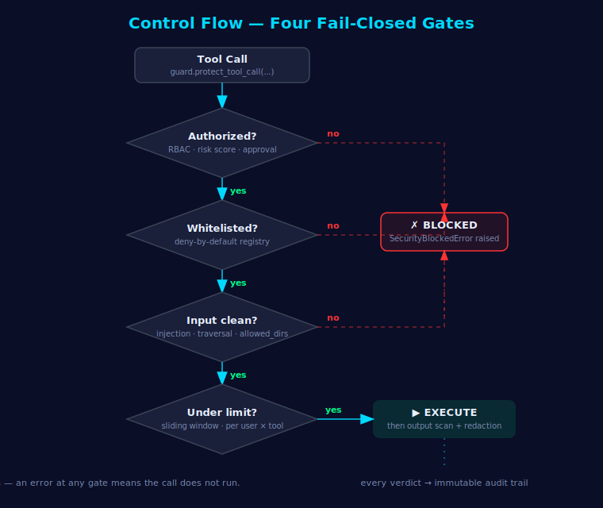
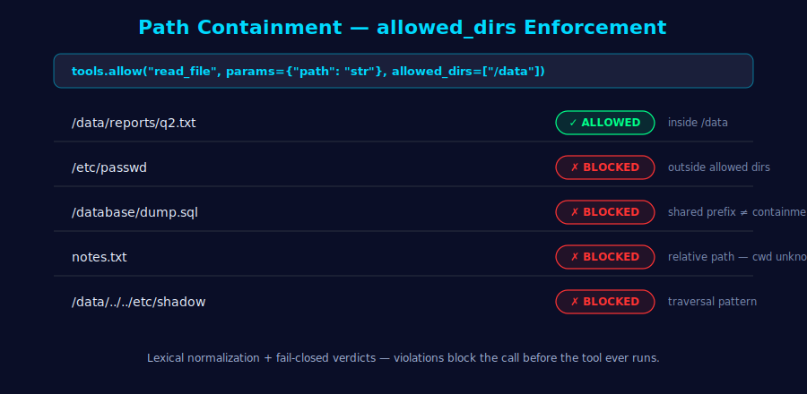
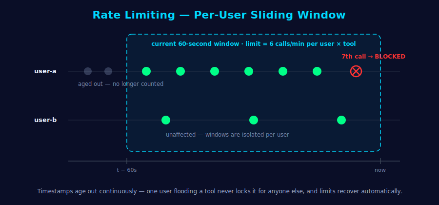
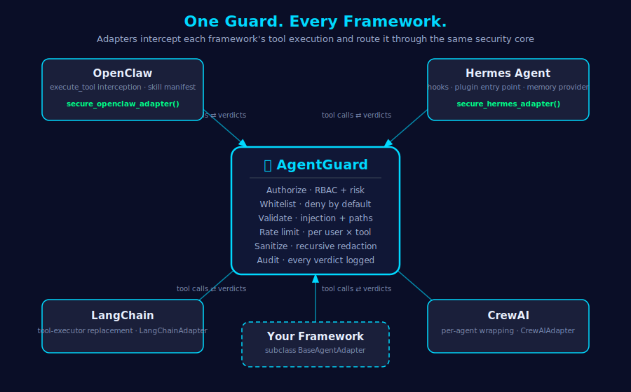

<div align="center">

# 🛡️ ClawSafe

### Defense-in-depth security for autonomous AI agents

Tool-execution guarding, memory protection, and behavioral analysis<br>
for OpenClaw, Hermes Agent, LangChain, CrewAI, and custom frameworks.


[Quick Start](#-quick-start) •
[How It Works](#-how-it-works) •
[Integrations](#-framework-integrations) •
[Threat Model](#-threat-model) •
[Documentation](#-documentation) •
[Contributing](#-contributing)

</div>

---

## Overview

Autonomous agents call tools, store memories, and act on untrusted input — every one of those steps is an attack surface. **ClawSafe** sits between your agent and its tools and applies deny-by-default, fail-closed security controls:

- 🛠️ **Tool execution** — whitelist enforcement, parameter validation, injection detection, `allowed_dirs` containment, per-user rate limiting
- 🧠 **Agent memory** — SHA-256 integrity hashing, contradiction detection, per-memory access control, TTL expiration
- 📈 **Behavior** — baseline profiling, anomaly detection, learning-loop integrity
- 🧾 **Audit** — every decision (allow *and* block) recorded in a queryable SQLite trail

Detection is **deterministic and rule-based**: the same input always produces the same verdict, with no ML inference in the hot path. **The guard's runtime never calls an LLM** — protecting a tool call is pure-Python, fast, offline-capable, and immune to a compromised model (enforced by [`test_runtime_llm_free.py`](tests/test_runtime_llm_free.py)). In this project the LLM's role is *testing and policy authoring*, never the agent's live protection path.

## 📦 One Package, Two Tiers

ClawSafe ships as a single package; you select what you load purely by import. The base install has **zero dependencies**.

| | 🪶 Lite — the taste | 🏗️ Full — the framework |
|---|---|---|
| **Install** | `pip install clawsafe-agent` | same install — tiers are selected by import |
| **Import** | `from clawsafe import guarded, protect_agent, scan_messages` | `from clawsafe.full import AgentGuard, MemoryGuard, ...` |
| **What you get** | A decorator for single functions, an auto-detecting agent wrapper, standalone input/output scanners | The eight-phase orchestrator, memory security + learning loop, framework adapters, hardened presets, and LLM classes for the testing/authoring tools |
| **When** | Demos, quick hardening, frameworks without adapters | Production deployments, audit requirements, memory-aware agents |

Nothing from the full tier loads until you touch it — `from clawsafe import AgentGuard` lazily pulls in exactly that module and no more. **Both tiers are zero-dependency, and the guard runtime never calls an LLM.** The optional `[providers]` extra is only for the opt-in **LLM tooling that tests or authors** — the L3 live benchmark, the LLM red-teamer, and LLM-drafted policies — plus the legacy `ClawSafeAgent` wrapper. None of that sits in the protection path. Lite is not a different engine: it routes through the same pipeline the full tier uses.

## ✨ Highlights

| | |
|---|---|
| **Fail-closed by design** | Unauthorized, unregistered, or policy-violating calls are blocked — severity flags tune warnings, never bypass authorization |
| **Two tiers, one package** | Zero-dependency lite tier on plain install; the full framework loads lazily, only when you import it |
| **One-line integration** | `protect_agent(agent, tools=...)` auto-detects the framework; `@guarded` protects a single function with no framework at all |
| **One-call hardening** | `secure_openclaw_adapter()` / `secure_hermes_adapter()` give an agent strict mode + a pre-applied denylist of 13 dangerous tools |
| **Argument-level policies** | Progent-style declarative rules: allow `transfer_funds` only when `amount ≤ 100` and the recipient is allowlisted — with priorities and soft-block fallbacks |
| **LLM tests the guard, never runs it** | The runtime is LLM-free; an LLM is used only to *draft* policies (reviewed & committed as static rules) and to *red-team* the guard with generated attacks — not in the agent's protection path |
| **Benchmarked, not asserted** | Agent3Sigma-style L1 benchmark in CI: 0% attack success across 7 risk categories, 100% benign utility |
| **Path containment** | File tools are confined to `allowed_dirs`; traversal patterns, sibling-prefix tricks, and relative paths are rejected |
| **Sliding-window rate limits** | Per-user, per-tool quotas that actually reset — flooding one identity never blocks another |
| **Recursive output redaction** | Credentials are detected and `[REDACTED]` even when nested deep inside structured tool results |
| **33 documented policies** | Pre-execution, post-execution, memory, integration, and behavioral controls ([full list](docs/features/policies.md)) |

## 🚀 Quick Start

### Install

```bash
pip install clawsafe-agent                # the whole framework — zero dependencies
pip install "clawsafe-agent[providers]"   # only for the opt-in LLM testing/authoring tools
```

### One line, whole agent

```python
from clawsafe import protect_agent

agent = protect_agent(agent, tools={"search": search_func})
```

The framework is auto-detected (OpenClaw-style `execute_tool`, Hermes-style `call_function`), the hardened preset is applied, and anything you didn't register is denied.

### One decorator, single function

No agent, no adapter — guard any Python function directly:

```python
from clawsafe import guarded

@guarded(params={"path": "str"}, allowed_dirs=["/data"])
def read_file(path: str) -> str:
    ...

read_file(path="/data/notes.txt")   # validated, rate limited, audited
read_file(path="/etc/passwd")       # raises SecurityBlockedError
```

And for frameworks without an adapter, the standalone scanners drop into any loop:

```python
from clawsafe import scan_messages, scan_output

findings = scan_messages([{"role": "user", "content": user_input}])  # pre-LLM
findings = scan_output(model_response)                               # post-LLM
```

### Protect a tool-calling agent

```python
from clawsafe import AgentGuard, AgentGuardConfig, AuthContext, ToolRegistry

# 1. Declare what the agent may do — everything else is denied
tools = ToolRegistry()
tools.allow("search", params={"query": "str"}, risk_level="low")
tools.allow("read_file", params={"path": "str"}, allowed_dirs=["/data"])
tools.deny("shell_exec")

# 2. Create the guard
guard = AgentGuard(AgentGuardConfig(tool_registry=tools))

# 3. Route every tool call through it
auth = AuthContext(user_id="user-123", role="user")
result = guard.protect_tool_call(
    tool_name="search",
    params={"query": "python security"},
    auth_context=auth,
    executor=my_search_func,
)
print(result.output)          # tool result (sanitized)
print(result.findings)        # any security findings raised along the way
```

A blocked call raises `SecurityBlockedError` with the policy that fired:

```python
guard.protect_tool_call("read_file", {"path": "/etc/passwd"}, auth, executor=read_file)
# SecurityBlockedError: Path '/etc/passwd' for tool read_file is outside the allowed directories
```

### Harden OpenClaw or Hermes Agent in one call

```python
from clawsafe.integrations import secure_openclaw_adapter, secure_hermes_adapter

adapter = secure_openclaw_adapter()   # or secure_hermes_adapter()
adapter.register_tool("search", search_func, params={"query": "str"}, risk_level="low")

protected_agent = adapter.wrap_agent(agent)
```

The hardened preset enables strict authorization, blocks on medium+ severity findings, turns on rate limiting and output sanitization, and pre-denies `shell_exec`, `eval`, `delete_file`, and ten other dangerous tool names. Only tools you explicitly register can run.

### Argument-level least privilege (policy engine)

Whitelisting says *which* tools may run; the policy engine says *with which arguments* — declarative JSON rules with predicates, priorities, and fallbacks, in the style of [Progent](https://arxiv.org/abs/2504.11703) (Berkeley):

```python
from clawsafe import AgentGuard, AgentGuardConfig, PolicyEngine

policy = PolicyEngine(rules=[
    {"tool": "transfer_funds", "effect": "allow", "conditions": {"all": [
        {"param": "amount", "lte": 100},
        {"param": "recipient", "in_": ["alice@corp.com", "bob@corp.com"]},
    ]}},
    {"tool": "transfer_funds", "effect": "forbid", "priority": -1,
     "fallback": "message",   # soft-block: the agent gets an explanation instead of an exception
     "message": "Transfers are limited to $100 and known recipients."},
])

guard = AgentGuard(AgentGuardConfig(tool_registry=tools, policy_engine=policy))
```

Rules can also be loaded from JSON files (`policy.load_file("policies.json")`) so privilege policies live in version control next to your code.

**LLM-assisted policy authoring** — let a model *draft* the least-privilege rules for a task, then review and commit them as static JSON that the deterministic engine enforces (the LLM is not in the runtime). ClawSafe treats generated policy as *untrusted input*: a prompt-injected model **cannot widen access** (generated `allow` rules are honored only for already-whitelisted tools, never denied ones or `*`), human rules always outrank generated ones, and updates from tool output can only *tighten* policy, never loosen it.

Run this **offline, at authoring time** — draft rules, review them, commit the JSON — so no LLM call touches the live request path:

```python
from clawsafe import PolicyGenerator
from clawsafe.core.policy_generation import build_engine

gen = PolicyGenerator(my_llm_fn)   # any prompt->text callable; from_provider() for a full-tier provider
generated = gen.generate(user_task, tool_specs, denied_tools=["shell_exec"])
engine = build_engine(generated, generic_rules=my_human_rules)
# review generated.rules, then commit them as static JSON that the deterministic engine loads
```

Even a fully-compromised model can't grant itself a dangerous tool — the sanitizer drops it, the registry denies it, or the human rule outranks it (three independent layers).

### Memory-aware agent with protected learning

```python
agent = AgentGuard(config, agent_id="assistant-001")

agent.process_interaction("Tell me about security", user_id="user-123", session_id="sess-1")

result = agent.execute_tool_with_learning(
    "search", {"query": "cybersecurity"}, auth, executor=search_func,
)

agent.process_user_feedback(memory_id, feedback="Good!", rating=0.95, user_id="user-123")
insights = agent.get_agent_insights()   # profile, learning progress, tool effectiveness
```

More complete, runnable examples live in [`examples/`](examples/).

## ⚙️ How It Works

Every tool call passes through an eight-phase pipeline. Authorization and registry checks are **always fail-closed**; validation phases are configurable. Watch a legitimate call reach a sanitized result while a malicious one gets diverted:

<div align="center">



</div>

<details>
<summary><strong>⛩️ Control flow — the four fail-closed gates</strong></summary>
<br>
<div align="center">



</div>
</details>

<details>
<summary><strong>📁 Path containment — <code>allowed_dirs</code> in practice</strong></summary>
<br>
<div align="center">



</div>
</details>

<details>
<summary><strong>⏱️ Rate limiting — per-user sliding window</strong></summary>
<br>
<div align="center">



</div>
</details>

<div align="center">

**Architecture:** [`ToolRegistry`](clawsafe/core/tools.py) + [`ActionAuthorizer`](clawsafe/core/auth.py) + [`Validators`](clawsafe/core/validator.py) orchestrated by [`AgentGuard`](clawsafe/core/agent_guard.py), with [`MemoryGuard`](clawsafe/core/memory_security.py) protecting agent knowledge — see the [architecture guide](docs/architecture.md) and [diagrams](docs/assets/diagrams/).

</div>

## 🔌 Framework Integrations

<div align="center">



</div>

| Framework | Integration point | Hardened preset |
|---|---|---|
| **OpenClaw** | `execute_tool` interception + skill manifest install | `secure_openclaw_adapter()` |
| **Hermes Agent** | Function-call interception, plugin entry point, memory provider | `secure_hermes_adapter()` |
| **LangChain** | Tool-executor replacement | — |
| **CrewAI** | Per-agent wrapping | — |
| **Custom** | Subclass [`BaseAgentAdapter`](clawsafe/integrations/base_adapter.py) | — |

Adapter hardening applies across the board: untrusted agent state cannot claim privileged roles, agents are never double-wrapped, OpenAI-style nested tool specs are parsed correctly, and tools without a resolvable name are dropped (fail closed).

## 🎯 Threat Model

| Threat | Attack vector | ClawSafe response |
|---|---|---|
| **Prompt injection** | Input tricks agent into unauthorized calls | Pre-execution validation + pattern detection |
| **Memory poisoning** | Adversarial data corrupts agent knowledge | Contradiction detection + integrity hashing |
| **Privilege escalation** | Unauthorized access to high-risk tools | Fine-grained authorization + role clamping |
| **Command injection** | Shell metacharacters in parameters | Pattern blocking |
| **Path traversal** | Directory escape in file operations | Traversal patterns + `allowed_dirs` containment |
| **Credential leakage** | Secrets in requests or responses | Detection + recursive redaction |
| **Behavioral drift** | Decision patterns change unexpectedly | Baseline profiling + anomaly detection |
| **Rate-based DoS** | Tool-call flooding | Per-user sliding-window limits |
| **Access-control bypass** | Unauthorized memory/tool access | RBAC + per-memory permissions |
| **Supply chain** | Malicious tool registration | Whitelisting + high-risk-name quarantine |

Every threat class maps to specific policies with recorded audit evidence — see [threat modeling guide](docs/threat-modeling.md).

<details>
<summary><strong>📋 All 33 security policies</strong></summary>

**Pre-execution (8):** tool authorization · parameter validation · command injection · SQL injection · path traversal · credential detection · privilege escalation · rate limiting

**Post-execution (8):** output validation · error detection · credential leakage · output sanitization · memory integrity · anomaly detection · behavior drift · resource audit

**Memory security (9):** memory poisoning · prompt injection (memory) · invalid confidence · suspicious confidence jumps · tampering detection · access control · contradiction detection · TTL management · audit trail

**Framework integration (5):** tool registry whitelist · fine-grained authorization · session tracking · compliance logging · state export

**Advanced (3):** behavioral baselines · feedback loops · learning-gap identification

Full details with threat mappings: [docs/features/policies.md](docs/features/policies.md)

</details>

## 🥇 Security Benchmark

ClawSafe measures itself the way [Agent3Sigma](https://github.com/antgroup/Agent3Sigma) (Tsinghua/Ant Group) measures agents — attack scenarios across **all 7 risk categories** plus benign utility tasks — and adopts its three tiers:

```bash
python benchmarks/run_benchmark.py --level all   # L1 static + L2 multi-turn
python benchmarks/run_l3.py                       # L3 live (opt-in, real model)
python benchmarks/run_redteam.py                  # LLM red-team (opt-in): a model
                                                  # generates attacks; gaps are surfaced
# L3 and red-team also use an LLM-as-judge (opt-in) to grade outcomes semantically
# and filter generated attacks — evaluation only, never the guard runtime.
```

| Tier | What it tests | Runs in |
|---|---|---|
| **L1** static | single actions scored in isolation | CI |
| **L2** multi-turn | *indirect* attacks via tool output, acted on across turns | CI |
| **L3** live | the guard around a real LLM-driven tool loop | opt-in |

Current reference-deployment results (a regression on any L1/L2 scenario fails the build):

| Metric | L1 | L2 |
|---|---|---|
| Attack success rate | **0.0%** | **0.0%** |
| Security awareness | **100%** | **100%** |
| Benign task success | **100%** | **100%** |

See [docs/comparative-frameworks.md](docs/comparative-frameworks.md) for how ClawSafe relates to Progent, Agent3Sigma, and other state-of-the-art work.

## 📊 Performance

Designed for the agent hot path — all checks are rule-based, no model inference:

| Operation | Target |
|---|---|
| Tool-call security overhead | < 100 ms |
| Memory store / retrieve / verify | < 1 ms |
| Integrity check (SHA-256) | < 0.5 ms |
| Anomaly detection | < 5 ms |
| Total overhead | < 5 % |

## 🏢 Compliance Support

ClawSafe's audit trail, access controls, and redaction are built to **support** compliance programs (they don't confer certification by themselves):

- **SOC 2** — immutable audit trail, access-control matrix, incident logging
- **HIPAA** — credential protection, PII detection and redaction, access restrictions
- **GDPR** — per-memory access control, TTL-based deletion, user attribution

## 📚 Documentation

| Resource | Contents |
|---|---|
| [Getting Started](GETTING_STARTED.md) | 5-minute quickstart for all providers |
| [Website](https://akafengfeng.github.io/ClawSafeTest/) | Guides, architecture, policies, diagrams |
| [Architecture](docs/architecture.md) | Core design, pipeline, component reference |
| [Security Policies](docs/features/policies.md) | Every policy with threat model and response |
| [Providers](PROVIDERS.md) | Configuring an LLM for the testing/authoring tools (not the runtime) |
| [Memory Integration](MEMORY_INTEGRATION_SUMMARY.md) | Agent learning and memory protection |
| [Security Policy](SECURITY.md) | Vulnerability reporting and disclosure |
| [Examples](examples/) | Four complete, runnable examples |

## 🧪 Development

```bash
git clone https://github.com/akafengfeng/ClawSafeTest.git
cd ClawSafeTest
pip install -e ".[dev]"

python -m pytest tests/     # 216 tests
ruff check clawsafe/ tests/ # lint
```

CI runs lint plus the full test matrix on Python 3.11 and 3.12 for every push and pull request.

## 🤝 Contributing

This is a security-first project. Contributions must:

1. Pass security review for new threat vectors
2. Include tests for all security-relevant code paths
3. Update the threat-model documentation when behavior changes
4. Follow the principle of least privilege

See [CONTRIBUTING.md](CONTRIBUTING.md) for the full workflow and [CODE_OF_CONDUCT.md](CODE_OF_CONDUCT.md) for community standards.

## 🔒 Reporting Security Issues

Please report suspected vulnerabilities **privately** — see [SECURITY.md](SECURITY.md). Fail-open bugs (a call executing that policy says should block) are treated as highest severity.

## 📄 License

Apache License 2.0 — see [LICENSE](LICENSE).

---

<div align="center">
<sub>Built for teams that treat agent security as a requirement, not a feature.</sub>
</div>
