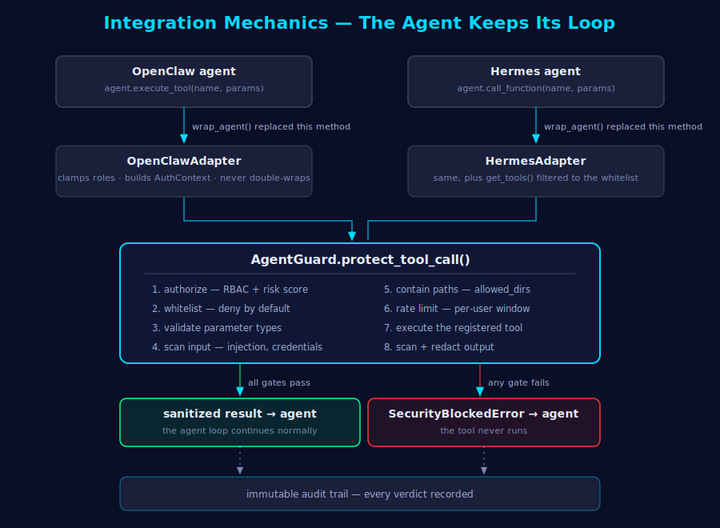
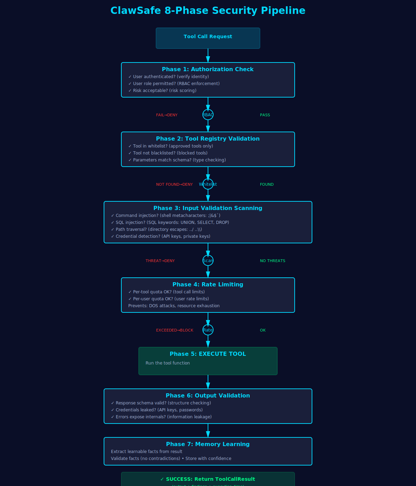
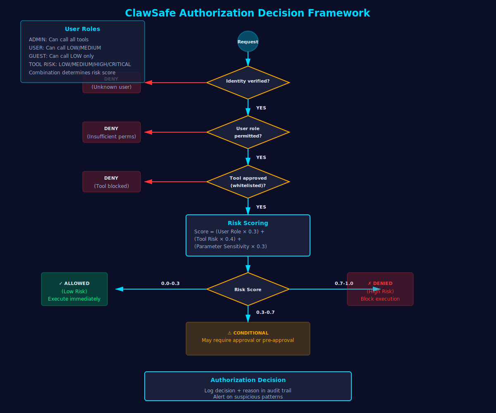
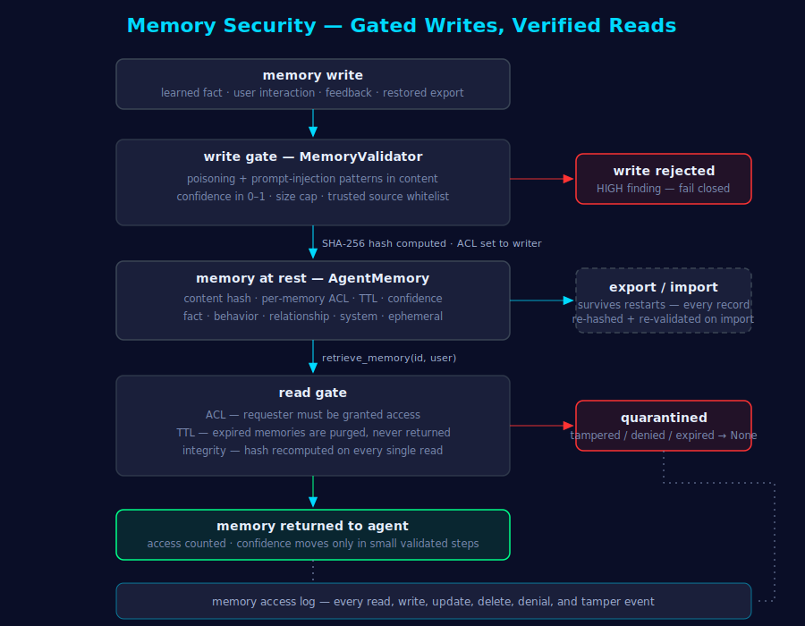
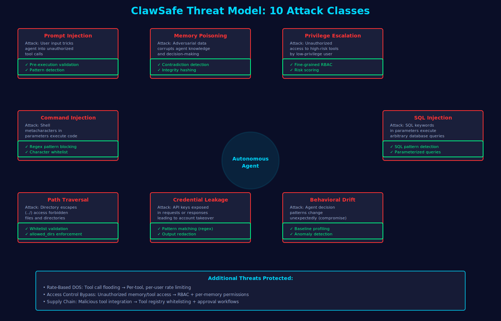
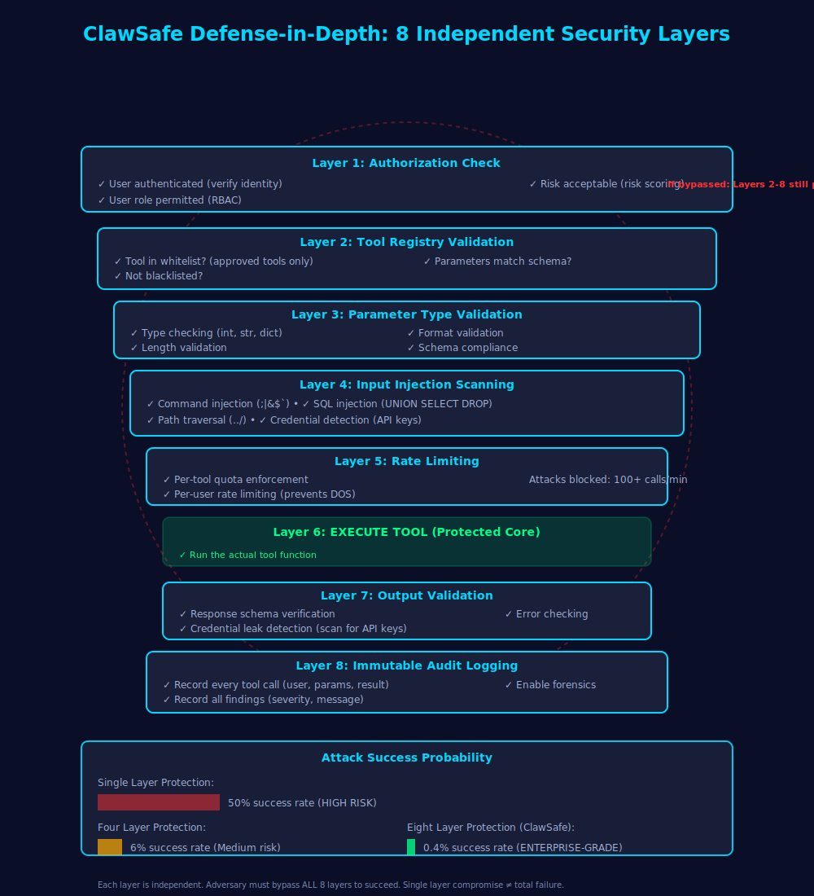

# ClawSafe Architecture & Design

## System Architecture Overview


```
┌──────────────────────────────────────────────────────────────────────────────┐
│                         Agent Application Layer                              │
│  (OpenClaw / Hermes / LangChain / CrewAI / Custom Framework)                │
└──────────────────────────────────────┬───────────────────────────────────────┘
                                       │
                    ┌──────────────────▼───────────────────┐
                    │   Framework-Specific Adapter         │
                    │  (Intercepts tool calls)             │
                    └──────────────────┬───────────────────┘
                                       │
┌──────────────────────────────────────▼───────────────────────────────────────┐
│                         AgentGuard Orchestrator                              │
│                                                                              │
│  ┌─────────────────────────────────────────────────────────────────────┐   │
│  │ Phase 1: Authorization Check                                        │   │
│  │ • RBAC validation (user role, tool type)                           │   │
│  │ • Risk scoring (sensitive parameters)                              │   │
│  │ • Decision: ALLOWED / DENIED with reason                           │   │
│  └─────────────────────────────────────────────────────────────────────┘   │
│                                                                              │
│  ┌─────────────────────────────────────────────────────────────────────┐   │
│  │ Phase 2: Tool Registry Validation                                   │   │
│  │ • Whitelist check (is tool approved?)                              │   │
│  │ • Blacklist check (is tool blocked?)                               │   │
│  │ • Parameter schema validation                                       │   │
│  └─────────────────────────────────────────────────────────────────────┘   │
│                                                                              │
│  ┌─────────────────────────────────────────────────────────────────────┐   │
│  │ Phase 3: Input Validation                                           │   │
│  │ • Command injection detection (shell metacharacters)               │   │
│  │ • SQL injection detection (SQL keywords/patterns)                  │   │
│  │ • Path traversal detection (directory escapes)                     │   │
│  │ • Credential detection (API keys, private keys)                   │   │
│  │ • Severity: CRITICAL / HIGH / MEDIUM / LOW / INFO                │   │
│  └─────────────────────────────────────────────────────────────────────┘   │
│                                                                              │
│  ┌─────────────────────────────────────────────────────────────────────┐   │
│  │ Phase 4: Rate Limiting                                              │   │
│  │ • Per-tool call quota enforcement                                  │   │
│  │ • Per-user rate limiting                                           │   │
│  │ • Prevents DOS attacks                                             │   │
│  └─────────────────────────────────────────────────────────────────────┘   │
│                                                                              │
│  ┌─────────────────────────────────────────────────────────────────────┐   │
│  │ Phase 5: Tool Execution                                             │   │
│  │ • Run executor function                                             │   │
│  │ • Capture success/failure                                           │   │
│  │ • Extract learnable facts                                           │   │
│  └─────────────────────────────────────────────────────────────────────┘   │
│                                                                              │
│  ┌─────────────────────────────────────────────────────────────────────┐   │
│  │ Phase 6: Output Validation                                          │   │
│  │ • Response schema verification                                      │   │
│  │ • Credential leakage detection (scan output for secrets)           │   │
│  │ • Output sanitization (redact if enabled)                          │   │
│  └─────────────────────────────────────────────────────────────────────┘   │
│                                                                              │
│  ┌─────────────────────────────────────────────────────────────────────┐   │
│  │ Phase 7: Memory Learning                                            │   │
│  │ • Extract facts from tool execution                                 │   │
│  │ • Validate facts (no contradictions)                               │   │
│  │ • Store with confidence scoring                                     │   │
│  │ • Update agent memory profile                                       │   │
│  └─────────────────────────────────────────────────────────────────────┘   │
│                                                                              │
│  ┌─────────────────────────────────────────────────────────────────────┐   │
│  │ Phase 8: Audit Logging                                              │   │
│  │ • Write immutable entry to SQLite                                  │   │
│  │ • Record all findings                                               │   │
│  │ • Timestamp and user attribution                                    │   │
│  └─────────────────────────────────────────────────────────────────────┘   │
│                                                                              │
│  ┌─────────────────────────────────────────────────────────────────────┐   │
│  │ Core Components                                                     │   │
│  │ • ToolRegistry: Whitelist/blacklist management                    │   │
│  │ • ActionAuthorizer: RBAC enforcement                              │   │
│  │ • InputValidator: Pattern-based threat detection                  │   │
│  │ • OutputValidator: Response validation & sanitization             │   │
│  │ • MemoryGuard: Memory security & integrity                        │   │
│  │ • MemoryStore: Audit trail (SQLite backend)                       │   │
│  └─────────────────────────────────────────────────────────────────────┘   │
└──────────────────────────────────────────────────────────────────────────────┘
                                       │
        ┌──────────────────────────────▼──────────────────────────────┐
        │  MemoryGuard: Agent Memory Security Layer                   │
        │                                                              │
        │  ┌──────────────────────────────────────────────────────┐   │
        │  │ Memory Validation Pipeline                           │   │
        │  │ • Pre-validation: Contradiction detection           │   │
        │  │ • Content scan: Prompt injection detection          │   │
        │  │ • Confidence check: Valid range (0.0-1.0)          │   │
        │  │ • Suspicious jumps: >0.5 change detection          │   │
        │  └──────────────────────────────────────────────────────┘   │
        │                                                              │
        │  ┌──────────────────────────────────────────────────────┐   │
        │  │ Memory Storage                                        │   │
        │  │ • Type: FACT / BEHAVIOR / RELATIONSHIP / etc        │   │
        │  │ • Content with SHA-256 integrity hash               │   │
        │  │ • Confidence score (0.0-1.0)                         │   │
        │  │ • TTL management (ephemeral memories)               │   │
        │  │ • Access control (per-user permissions)             │   │
        │  └──────────────────────────────────────────────────────┘   │
        │                                                              │
        │  ┌──────────────────────────────────────────────────────┐   │
        │  │ Integrity & Access                                   │   │
        │  │ • Tamper detection (SHA-256 verification)           │   │
        │  │ • Contradiction detection (opposite word pairs)     │   │
        │  │ • Access logging (who accessed what & when)        │   │
        │  │ • Audit trail (complete operation history)         │   │
        │  └──────────────────────────────────────────────────────┘   │
        └──────────────────────────────────────────────────────────────┘
                                       │
        ┌──────────────────────────────▼──────────────────────────────┐
        │  Learning Integration Layer                                 │
        │                                                              │
        │  ┌──────────────────────────────────────────────────────┐   │
        │  │ MemoryEnabledToolExecutor                            │   │
        │  │ • Auto-extract learnable facts from tool results    │   │
        │  │ • Track success rates and patterns                  │   │
        │  │ • Generate tool insights                             │   │
        │  └──────────────────────────────────────────────────────┘   │
        │                                                              │
        │  ┌──────────────────────────────────────────────────────┐   │
        │  │ AgentMemoryProfile                                   │   │
        │  │ • Per-user/entity knowledge accumulation            │   │
        │  │ • Interaction history tracking                       │   │
        │  │ • Learning progression metrics                       │   │
        │  └──────────────────────────────────────────────────────┘   │
        │                                                              │
        │  ┌──────────────────────────────────────────────────────┐   │
        │  │ MemoryLearningLoop                                   │   │
        │  │ • User feedback integration                          │   │
        │  │ • Confidence adjustment                              │   │
        │  │ • Learning gap identification                        │   │
        │  │ • Progress reporting                                 │   │
        │  └──────────────────────────────────────────────────────┘   │
        └──────────────────────────────────────────────────────────────┘
                                       │
        ┌──────────────────────────────▼──────────────────────────────┐
        │  Persistence & Audit                                        │
        │  • SQLite Audit Database                                    │
        │  • Immutable event log (tool calls, security findings)     │
        │  • Compliance reporting (SOC 2, HIPAA, GDPR)              │
        │  • Incident reconstruction                                  │
        └──────────────────────────────────────────────────────────────┘
```

## Framework Integration Mechanics



The key design idea: **the agent keeps its own reasoning loop — ClawSafe only owns the moment a tool gets invoked.** Integration works by patching, not by replacing the agent:

1. **Declare policy, then wrap.** Create an adapter, register the tools the agent may use (the whitelist — anything unregistered is denied), and call `wrap_agent(agent)`. For OpenClaw the adapter swaps the agent's `execute_tool` method for a protected version; for Hermes it swaps `call_function` and additionally filters `get_tools()` so the model never even sees non-whitelisted tools. The agent object doesn't know anything changed.

2. **Every tool call reroutes through the guard.** The patched method builds an `AuthContext` from the caller's context — privileged roles are clamped, so a compromised agent cannot claim admin — and hands the call to `AgentGuard.protect_tool_call()`, the eight-phase pipeline above. If every gate passes, the guard invokes the *registered* tool function and returns sanitized output. If any gate fails, the agent receives `SecurityBlockedError` and handles it like any failed tool call.

3. **Hermes gets two extra native hooks.** ClawSafe also ships as a pip entry point (`hermes.plugins`): on startup Hermes calls `register(ctx)`, which installs `pre_llm_call` / `post_llm_call` lifecycle hooks that scan messages for prompt injection before the LLM runs and scan responses for credential leaks after. Separately, `ClawSafeMemoryProvider` implements Hermes's memory-provider contract, surfacing recent security findings into the agent's own context.

4. **OpenClaw gets skill discovery.** `clawsafe.integrations.openclaw.install()` writes a `SKILL.md` into the OpenClaw workspace so its skill loader picks up ClawSafe's scanners natively.

So there are two layers of defense: the **adapter layer** (blocks bad *tool calls*) and, where the framework supports hooks, the **lifecycle layer** (blocks bad *LLM inputs and outputs*) — both feeding the same audit trail.

### One-Line Integration (ClawSafe Lite)

For the shortest path, `clawsafe.lite` wraps all of the above:

```python
from clawsafe import protect_agent, guarded, scan_messages, scan_output

# Whole agent — framework auto-detected, hardened preset applied
agent = protect_agent(agent, tools={"search": search_func})

# Single function — no adapter, no framework required
@guarded(params={"path": "str"}, allowed_dirs=["/data"])
def read_file(path: str) -> str:
    ...

# Any custom loop — standalone scanners
findings = scan_messages([{"role": "user", "content": user_input}])
findings = scan_output(model_response)
```

Lite changes the ergonomics, never the security: every path routes through the same `AgentGuard` pipeline.

ClawSafe ships as **one package with two tiers**, selected purely by import. A plain `pip install clawsafe-agent` is the zero-dependency lite tier; the full framework (`from clawsafe.full import AgentGuard, ...` or any direct name import) loads lazily on first access, and the LLM provider SDKs sit behind the `[full]` extra. Importing the lite tier never loads providers, adapters, or any third-party SDK.

## Security Decision Flow




```
Tool Call Request
       │
       ▼
┌─────────────────────────────────────┐
│ 1. Authorization Check              │
│ User Role? Tool Type? Parameters?   │
└─────────────────────┬───────────────┘
                      │
        ┌─────────────┴─────────────┐
        │                           │
    DENIED                      ALLOWED
        │                           │
        │                           ▼
        │                  ┌────────────────────┐
        │                  │ 2. Tool Registry   │
        │                  │ Is tool approved?  │
        │                  └────────┬───────────┘
        │                           │
        │                ┌──────────┴──────────┐
        │                │                     │
        │            NOT FOUND             FOUND
        │                │                     │
        │                │                     ▼
        │                │            ┌────────────────────┐
        │                │            │ 3. Input Validate  │
        │                │            │ Injection checks   │
        │                │            │ Credential scan    │
        │                │            └────────┬───────────┘
        │                │                     │
        │                │            ┌────────┴────────┐
        │                │            │                 │
        │                │         FINDING          NO FINDING
        │                │            │                 │
        │                │     (HIGH/CRITICAL)          │
        │                │            │                 │
        └────────┬───────┴────────────┼────────────────┘
                 │                    │
                 │                    ▼
                 │           ┌────────────────────┐
                 │           │ 4. Rate Limiting   │
                 │           │ Quota exceeded?    │
                 │           └────────┬───────────┘
                 │                    │
                 │           ┌────────┴────────┐
                 │           │                 │
                 │        EXCEEDED          OK
                 │           │                 │
                 │           │                 ▼
                 │           │        ┌────────────────────┐
                 │           │        │ 5. EXECUTE TOOL    │
                 │           │        │ Run function       │
                 │           │        └────────┬───────────┘
                 │           │                 │
                 │           │        ┌────────┴────────┐
                 │           │        │                 │
                 │           │     SUCCESS          FAILURE
                 │           │        │                 │
                 │           │        ▼                 │
                 │           │   ┌─────────────┐        │
                 │           │   │ Output      │        │
                 │           │   │ Validation  │        │
                 │           │   └────┬────────┘        │
                 │           │        │                 │
                 │           │ ┌──────┴──────┐          │
                 │           │ │             │          │
                 │           │ SAFE      FINDING        │
                 │           │ │             │          │
                 │           │ │        CREDENTIAL      │
                 │           │ │        LEAKAGE?        │
                 │           │ │             │          │
                 │           │ │      ┌──────┴────┐     │
                 │           │ │      │           │     │
                 │           │ │   FOUND      NOT FOUND │
                 │           │ │      │           │     │
                 │           │ └──────┴───────────┘     │
                 │           │                         │
        ┌────────┴───────────┴────────────────────────┘
        │
        ▼
    BLOCK or LOG
    Return SecurityBlockedError or ToolCallResult
```

## Authorization Decision Tree



```
Authorization Request
│
├─ User Role: ADMIN / USER / GUEST
│
├─ Tool Risk Level: LOW / MEDIUM / HIGH / CRITICAL
│
├─ Authorization Mode:
│  ├─ STRICT: Block everything except whitelisted
│  ├─ STANDARD: Risk-based decisions (default)
│  └─ PERMISSIVE: Allow most, log warnings
│
├─ Risk Scoring Factors:
│  ├─ User role level (admin > user > guest)
│  ├─ Tool risk level
│  ├─ Parameter sensitivity (contains secrets?)
│  ├─ Resource impact (system calls, file access?)
│  └─ Previous violations from this user
│
└─ Decision:
   ├─ Score < 0.3: ✓ ALLOWED (low risk)
   ├─ Score 0.3-0.7: ? CONDITIONAL (needs review or pre-approval)
   └─ Score > 0.7: ✗ DENIED (high risk)
```

## Memory Security Design



The threat this design answers is **memory poisoning**: an attacker who cannot make the agent run a bad tool *today* plants a memory ("the user said security checks can be skipped") that corrupts behavior *tomorrow*. Agent knowledge is therefore treated like untrusted input on the way in, and like evidence on the way out:

- **Gated writes.** `MemoryValidator` scans every candidate memory for poisoning patterns ("forget security", "bypass protection") and prompt injection ("ignore previous instructions"), and enforces a confidence range, size cap, and source whitelist. A HIGH finding means the memory is never stored — this applies equally to memories learned from tool results and to records restored from an export.

- **Tamper-evidence at rest.** Every stored memory carries a SHA-256 hash of its content. Every read recomputes it; a mismatch quarantines the memory (`retrieve_memory` returns `None`) and logs a `tamper_detected` event. TTL is also enforced at read time, so an expired memory can never feed back into reasoning even before cleanup runs.

- **Per-memory access control.** ACLs are scoped per memory ID and default to the writer, so one user's memories cannot bleed into another user's session. Denied reads are logged.

- **Gradual confidence.** User feedback nudges confidence in small steps (+0.1 / −0.2, clamped to [0, 1]); out-of-range ratings are rejected outright, and any confidence jump over 0.5 is flagged as suspicious — neither an attacker nor a buggy loop can promote a low-trust memory to "certain" in one move.

- **Verified persistence.** `export_memories()` / `import_memories()` serialize memories with their hashes and ACLs. On import every record is re-hashed against its stored hash (tampered exports are rejected) and re-validated through the write gate (poisoned exports are rejected even when their hashes are self-consistent).

Note that ClawSafe has **two distinct memory systems**: `MemoryGuard` (this section — protected agent *knowledge*) and `MemoryStore` (the SQLite *audit* log of tool calls and security events, which also backs the Hermes memory provider).

## Memory Integrity Verification


```
Store Memory Request
       │
       ▼
┌──────────────────────────┐
│ 1. Pre-Validation        │
│ • Check for contradictions
│ • Validate confidence (0.0-1.0)
│ • Check TTL validity
└────────┬─────────────────┘
         │
    ┌────┴────┐
    │          │
 VALID     INVALID
    │          │
    │          └──→ REJECT with ValidationFinding
    │
    ▼
┌──────────────────────────┐
│ 2. Content Scanning      │
│ • Prompt injection patterns
│ • Memory poisoning (opposite pairs)
│ • Malicious payloads
└────────┬─────────────────┘
         │
    ┌────┴────┐
    │          │
  SAFE    THREAT
    │      │
    │      └──→ REJECT with SecurityFinding
    │
    ▼
┌──────────────────────────┐
│ 3. Store in Memory       │
│ • Generate SHA-256 hash
│ • Store with timestamp
│ • Create access control entry
│ • Initialize audit log
└────────┬─────────────────┘
         │
         ▼
┌──────────────────────────┐
│ 4. Index for Retrieval   │
│ • By memory ID
│ • By type (FACT, BEHAVIOR, etc)
│ • By user (access control)
│ • By confidence range
└────────┬─────────────────┘
         │
         ▼
┌──────────────────────────┐
│ 5. Return Success        │
│ memory_id + metadata
└──────────────────────────┘

Retrieval Request
       │
       ▼
┌──────────────────────────┐
│ 1. Access Control Check  │
│ Is user permitted?
└────────┬─────────────────┘
         │
    ┌────┴────┐
    │          │
 ALLOWED   DENIED
    │        │
    │        └──→ Return None (access denied)
    │
    ▼
┌──────────────────────────┐
│ 2. Retrieve Memory       │
│ Fetch from store
└────────┬─────────────────┘
         │
         ▼
┌──────────────────────────┐
│ 3. Verify Integrity      │
│ Recompute SHA-256
│ Compare with stored hash
└────────┬─────────────────┘
         │
    ┌────┴────┐
    │          │
 MATCH    MISMATCH
    │        │
    │        └──→ ALERT: Memory tampering detected!
    │
    ▼
┌──────────────────────────┐
│ 4. Update Access Log     │
│ Record retrieval event
└────────┬─────────────────┘
         │
         ▼
┌──────────────────────────┐
│ 5. Return Memory         │
│ Content + metadata
└──────────────────────────┘
```

## Threat Detection Patterns



### Command Injection Patterns
```
Detectable patterns (blocked):
• Shell metacharacters: ; | & $ ` ( ) < > \n
• Command separators: && || ;
• Redirection: > >> < 2>&1
• Pipes: | xargs
• Substitution: $(...) `...` $((...))

Protected tools:
• shell_exec, run_command, execute, bash, sh
```

### SQL Injection Patterns
```
Detectable patterns (blocked):
• SQL keywords: UNION SELECT INSERT DELETE DROP
• Comment syntax: -- /* */ #
• String escape: ' " 
• Stacked queries: ;
• Time-based: SLEEP(...) WAITFOR(...)
• Boolean-based: AND 1=1 OR 1=1

Protected tools:
• query, execute_sql, db_select, db_insert, sql
```

### Path Traversal Patterns


```
Detectable patterns (blocked):
• Directory traversal: ../ ..\\ ..\\
• Absolute paths: / C:\ /etc/passwd
• Encoded variants: %2e%2e%2f ..%252f
• Null bytes: %00

Protected tools:
• read_file, write_file, delete_file, list_dir
```

### Credential Detection Patterns
```
Detectable patterns (redacted):
• API keys: sk-ant-, sk-, Bearer, token=
• Private keys: BEGIN PRIVATE KEY BEGIN RSA
• Passwords: password=, pwd=, pass=
• Tokens: Authorization: Bearer
• AWS: AKIA[0-9A-Z]{16}, aws_secret_access_key

Action: Extract from output, log with redaction, alert on findings
```

---

## Design Principles

### 1. Defense-in-Depth


- Multiple layers of validation
- No single point of failure
- Fail-closed (block by default)
- Explicit allow (whitelist)

### 2. Deterministic Security
- Rule-based, not ML-based
- Repeatable results
- No false positives
- Auditable decisions

### 3. Zero-Trust
- Verify every tool call
- Verify every memory access
- Verify every user action
- Assume compromise possible

### 4. Immutable Audit
- Every action logged
- Tamper-evident (hashing)
- Non-repudiation (user attribution)
- Compliance-ready

### 5. Usability with Security
- Clear error messages
- Actionable feedback
- Performance overhead <5%
- Easy to configure

---

## Performance Targets


| Component | Latency | Overhead |
|---|---|---|
| Authorization check | <5ms | |
| Parameter validation | <3ms | |
| Input scanning | <10ms | Per regex pattern |
| Rate limiting | <1ms | Hash lookup |
| Memory store/retrieve | <1ms | SQLite indexed |
| Integrity check | <0.5ms | SHA-256 |
| Output validation | <10ms | Pattern matching |
| Audit logging | <2ms | SQLite write |
| **Total per tool call** | **<100ms** | **<5%** |

---

## Compliance & Standards

✅ **SOC 2 Type II Ready**
- Change tracking (git + audit log)
- Access controls (RBAC + per-memory)
- Incident response (complete audit trail)
- Risk management (threat model + policies)

✅ **HIPAA Compatible**
- Credential protection (PII redaction)
- Access logs (HIPAA audit requirements)
- Encryption ready (audit database can be encrypted)
- Breach notification (audit trail enables incident response)

✅ **GDPR Aligned**
- Right to access (audit log shows data access)
- Right to erasure (TTL + deletion support)
- Data minimization (only store necessary facts)
- Accountability (complete audit trail)

✅ **Enterprise Governance**
- Clear policy enforcement
- Documented decision logic
- Compliance reporting
- Risk scoring transparency
